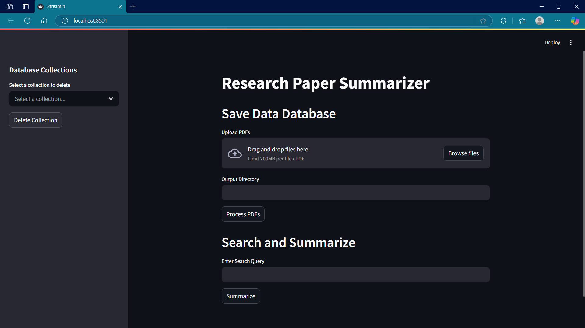
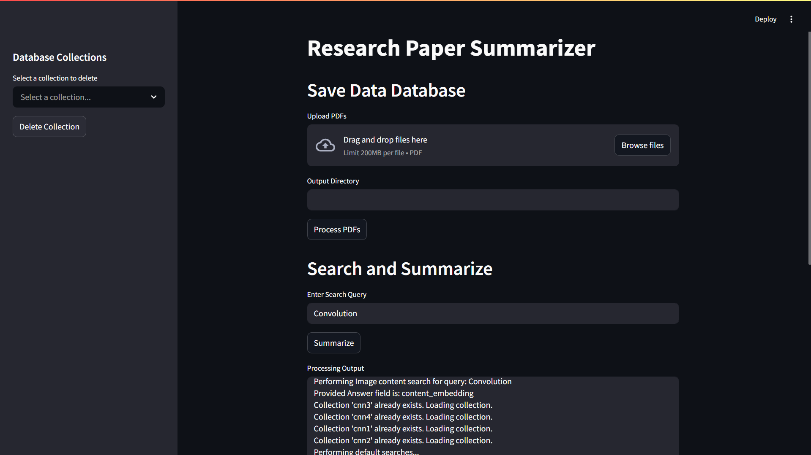
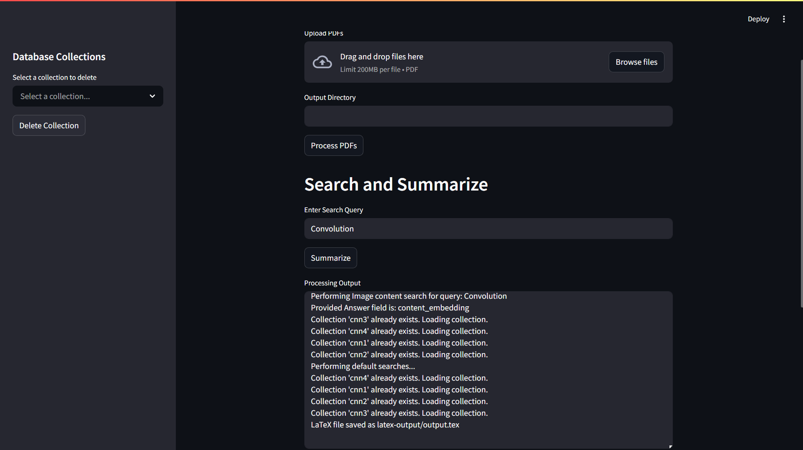

# 🧠 Research Paper Summarizer  

**Built during an NVIDIA Internship**, this intelligent end-to-end platform accelerates the way researchers engage with academic literature. It uses semantic search, LLM-powered summarization, and LaTeX PDF generation to extract deep insights from academic papers.

---

## 🚀 What It Does

A powerful AI-assisted tool that:
- 🧾 Automatically **summarizes research papers section-wise**
- 🔎 Performs **semantic search** across multiple papers
- 📄 Generates **publication-ready PDFs** in IEEE/ArXiv LaTeX format

---

## 🎯 Key Features

| Feature                         | Description                                                                 |
|---------------------------------|-----------------------------------------------------------------------------|
| 📂 Multi-PDF Upload             | Upload and analyze multiple research papers simultaneously                 |
| 🧠 Section-wise Summarization   | Summarizes Abstract, Introduction, Methods, Results, Conclusion, etc.     |
| 🔍 Intelligent Semantic Search  | Retrieves relevant excerpts using topic-based embedding search             |
| 🖼️ Figure Extraction + Captioning | Auto-captures figures with LLM-generated captions                          |
| 📚 Literature Review Insights   | Extracts citation chains and builds a mini literature review               |
| 📑 IEEE-style Reference Generation | Auto-formats references in IEEE style                                    |
| 📄 LaTeX-based PDF Generation   | Outputs structured PDFs mimicking IEEE/ArXiv two-column layouts            |

---

## ⚙️ Tech Stack

| Tech / Library            | Purpose                                                             |
|---------------------------|---------------------------------------------------------------------|
| **Streamlit**             | Interactive front-end for uploads, querying, and PDF generation     |
| **LlamaParse (Llama Cloud)** | Robust PDF-to-Markdown parser with structural and image extraction |
| **Sentence Transformers** | Generates vector embeddings for semantic search                     |
| **Pymilvus + Milvus DB**  | Stores vectorized content and enables fast semantic search          |
| **Gemini API**            | LLM-powered summarization and caption generation                    |
| **LaTeX (arxiv.cls)**     | Academic-style PDF generation for final output                      |

---

## 🧪 Example Workflow

> Use Case: Compare CNN methods across multiple research papers.

1. Upload 3+ papers related to **CNN architectures**.
2. Type a query like **"convolution techniques"**.
3. Click **Summarize**.
4. Receive a polished PDF containing:
   - 📌 Section-wise summaries from all papers  
   - 🖼️ Extracted and captioned figures  
   - 🔍 Highlighted excerpts relevant to your query  
   - 📑 IEEE-formatted citations

---

## 🔬 How It Works

### 1. 📥 Upload & Parse
- PDFs are parsed using **LlamaParse**, converted into Markdown and JSON.
- Section headers, paragraphs, citations, and images are extracted.

### 2. 🧠 Embed & Store
- Each section is embedded using **Sentence Transformers**.
- Stored in **Milvus** for real-time semantic retrieval via **Pymilvus**.

### 3. 🔎 Query & Summarize
- Input queries like `"transformer layers"` or `"self-attention"`.
- Relevant sections are retrieved and summarized using **Gemini API**.

### 4. 📄 Export to LaTeX PDF
- Markdown output is processed via `ToLatex.py`.
- Compiled into a professional, two-column **LaTeX PDF** using `arxiv.cls`.

---

## 🗂️ Project Structure

```
ResearchPaperSummarizer/
├── app.py              # Streamlit interface
├── parser.py           # LlamaParse integration
├── retrieval.py        # Milvus-based semantic search
├── usegemini.py        # Gemini API logic
├── ToLatex.py          # Markdown → LaTeX conversion
├── arxiv.sty           # IEEE/ArXiv LaTeX style file
├── automation.py       # Full pipeline automation
├── lln_prompt.py       # LLM prompt logic
├── paper.md            # Example markdown conversion of paper
├── latex-output/       # Generated LaTeX files
├── extracted/          # Intermediate Markdown/JSON data
├── images/             # Static assets (logos, screenshots)
├── output_directory/   # Final exported files
├── requirements.txt    # Python dependencies
└── README.md           # You're reading this!
```

---

## 📸 Screenshots

| Upload UI                      | Semantic Search Interface         | Final LaTeX PDF Output              |
|-------------------------------|-----------------------------------|-------------------------------------|
|         |             |               |

---

## ⚡ Installation

```bash
# Clone the repository
git clone https://github.com/your-username/ResearchPaperSummarizer.git
cd ResearchPaperSummarizer

# Install dependencies
pip install -r requirements.txt

# Launch the app
streamlit run app.py
```

---

## 🧠 Ideal For

- Researchers conducting **literature reviews**
- Students summarizing dense academic PDFs
- Data scientists seeking **quick insights** from papers
- Anyone building a **research dashboard** or **search engine for papers**

---

## 🙌 Acknowledgments

- Developed during my **internship at NVIDIA**
- Powered by state-of-the-art LLMs and open-source tools
- Inspired by the need for faster, smarter academic exploration

---

## 🔗 Future Improvements

- ✅ Hugging Face Space / Streamlit Cloud deployment  
- ✅ User authentication and file history  
- 🔄 Citation graph visualization  
- 🧠 GPT-4o integration for multi-modal figure interpretation  
- 📤 Export to Word/Markdown format  

---


